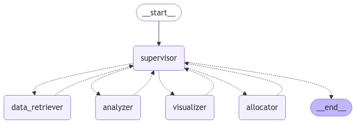

# AI-Stock-Analyzer

## Overview
AI-Stock-Analyzer is an AI-powered stock analysis tool that automates stock data retrieval, trend visualization, financial metric computation, and investment allocation recommendations.

## Features
- **Data Retrieval**: Fetches historical stock data using Yahoo Finance.
- **Trend Visualization**: Generates stock price trend charts.
- **Performance Analysis**: Computes annual returns and volatility.
- **Investment Allocation**: Recommends fund allocation based on stock performance.

## Architecture
The AI-Stock-Analyzer follows a structured workflow managed by a **supervisor agent** that coordinates different functional modules:

1. **Data Retriever**: This agent is responsible for fetching historical stock data from Yahoo Finance based on user input.
2. **Analyzer**: This agent computes financial metrics, including annual returns and volatility, to assess stock performance.
3. **Visualizer**: This agent generates trend charts to visualize stock performance over time.
4. **Allocator**: This agent recommends fund allocation strategies based on the computed metrics and trends.

The workflow is structured as shown in the diagram:



## Installation
1. Clone the repository:
   ```sh
   git clone https://github.com/your-repo/AI-Stock-Analyzer.git
   cd AI-Stock-Analyzer
   ```
2. Install dependencies:
   ```sh
   pip install -r requirements.txt
   ```

## Usage
Run the application using:
```sh
python app.py
```
The system will retrieve stock data, analyze trends, and provide allocation recommendations.

## Example Query and Output
### Input Query:
```
Help me decide how to distribute investments across META, MSFT, and AMD.
```

### Output:
1. **Data Retriever**: Fetches historical stock data for META, MSFT, and AMD.
2. **Analyzer**: Computes the annual returns and volatility for each stock.
3. **Visualizer**: Generates a graph showing stock price trends.
4. **Allocator**: Suggests an optimal allocation strategy based on risk and performance.

**Graph Output Placeholder:**


## Files
- `app.py`: Main script containing the AI workflow.
- `main.ipynb`: Jupyter notebook for exploratory analysis.
- `output.png`: Workflow visualization.
- `README.md`: Project documentation.

## Dependencies
- Python 3.12+
- `yfinance`
- `pandas`
- `numpy`
- `matplotlib`
- `langchain`
- `openai`

## Author
- Atharv Verma
- atharv.verma29k@gmail.com


